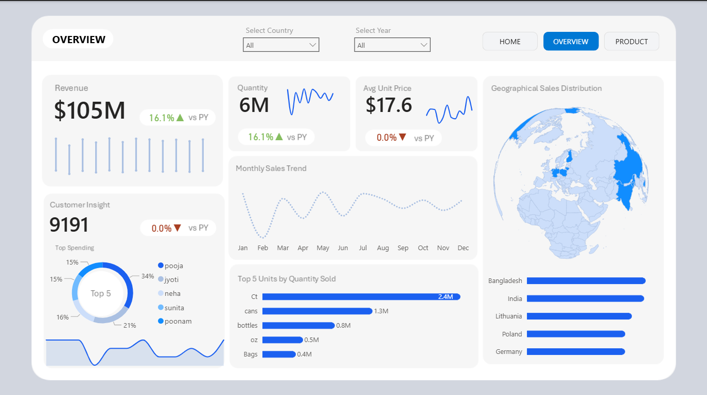
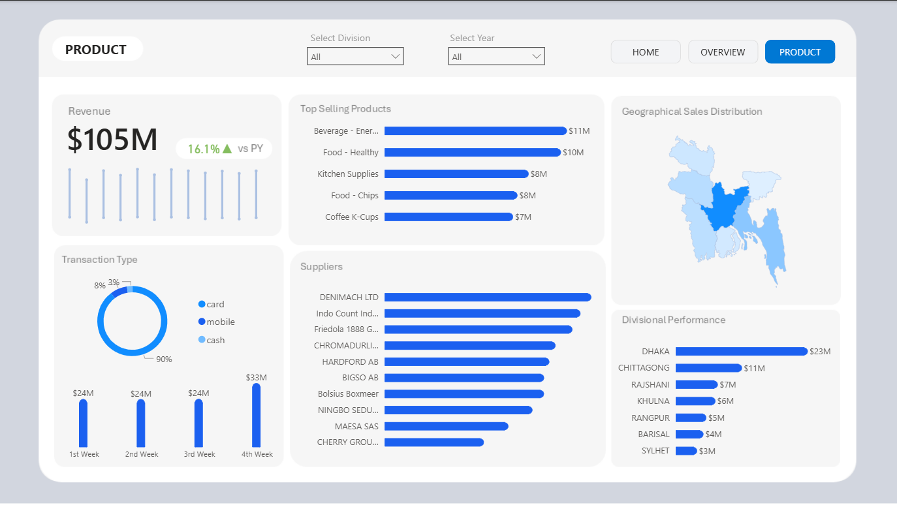
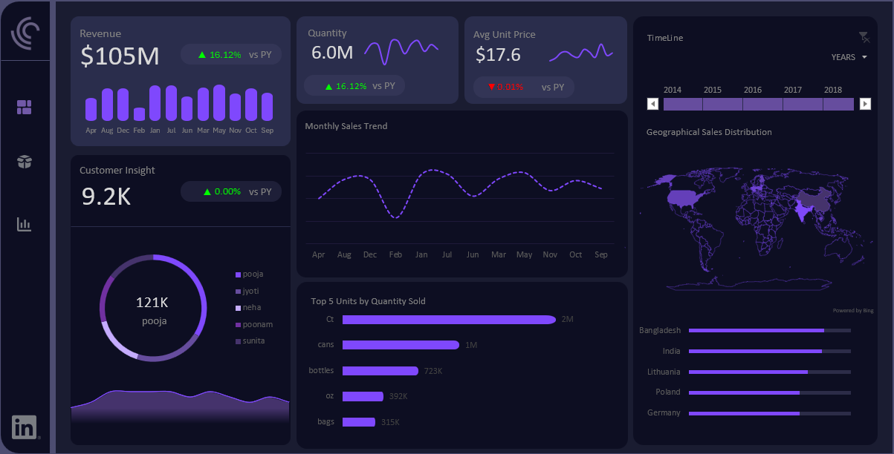

# 🛒 E-Commerce Sales Analysis Dashboard | Power BI & Excel

This project presents a complete **E-Commerce Sales Analysis Dashboard** built using **Power BI** and **Microsoft Excel**, designed to analyze sales performance, customer insights, and product profitability across countries and divisions.

---

## 📊 Project Overview

The goal of this project is to transform raw e-commerce transactional data into **interactive and insightful dashboards** that empower business users to track performance metrics, identify top-selling products, and analyze customer and regional trends.

---

## 🧠 Business Objectives

- Track key performance metrics — Total Revenue, Quantity Sold, and Avg. Unit Price  
- Identify top-performing **products**, **suppliers**, and **regions**  
- Analyze **year-over-year growth** and **monthly sales trends**  
- Understand **customer spending patterns** and **transaction types**

---

## 🗂️ Data Model 

| Type | Table Name | Description |
|------|-------------|--------------|
| **Fact** | `fact_table.csv` | Contains transactional-level sales data (revenue, quantity, item, date, etc.) |
| **Dimension** | `customer_dim.csv` | Customer details |
| **Dimension** | `item_dim.csv` | Product and category info |
| **Dimension** | `store_dim.csv` | Country and division details |
| **Dimension** | `time_dim.csv` | Time-based hierarchy (Year, Month, Week) |
| **Dimension** | `Trans_dim.csv` | Payment method/transaction type |

📦 **Note:**  
All dataset files are combined into a single ZIP file for easier access:  
➡️ [**E-Commerce dataset.zip**](Data/E-Commerce%20dataset.zip)  

Unzip the file to access all CSV files before importing them into Power BI or Excel.

---

## ⚙️ Tools & Techniques Used

| Tool | Purpose |
|------|----------|
| **Power BI** | Data modeling, DAX calculations, KPI visuals |
| **Excel** | Pivot Tables, Charts, Slicers, and Timeline Filters |
| **Power Query** | Data cleaning and transformations |
| **DAX** | KPIs, YoY Growth %, Avg Price calculations |
| **Data Modeling** | Fact-Dimension relationships in star schema |

---

## 💡 Key Insights

- 💵 **Total Revenue:** $105M (↑16.1% vs Previous Year)  
- 📦 **Quantity Sold:** 6 Million Units  
- 💰 **Avg. Unit Price:** $17.6  
- 👥 **Customers:** 9K+ Active Buyers  
- 🌍 **Top Countries:** India, Bangladesh, Poland, Germany  
- 🏆 **Top Categories:** Beverages, Healthy Food, Kitchen Supplies  

---

## 🔷 Power BI Dashboard Preview

### **1️⃣ Overview Page**
📍 Shows overall sales KPIs, YoY trends, customer insights, and geographical performance.  
🗺️ Interactive filters for **Country** and **Year**.  

---

### **2️⃣ Product Page**
📦 Product-level analysis by category, transaction type, suppliers, and division performance.  

---

## 🟣 Excel Dashboard Preview

### **1️⃣ Overview Page**
🎯 Replicates Power BI layout using advanced Excel tools like Power Pivot, Charts, and Slicers.  
🕒 Includes a **timeline filter** for year selection.  

---

### **2️⃣ Product Page**
📈 Highlights product-level performance, supplier contributions, and division revenue maps.  

---

## 📈 Insights Gained

- Revenue increased by **16.1%** compared to the previous year  
- **Card payments (90%)** dominate over other transaction types  
- **Dhaka Division** contributed the highest sales  
- Top customers and products consistently drive over **60% of total sales**  
- Seasonal patterns show strong mid-year growth  

---

## 🔗 Live Dashboard

View the interactive version of the dashboard here:  
👉 [**Power BI Live Dashboard**](https://app.powerbi.com/view?r=eyJrIjoiNTU3ZWY4Y2YtMDQwNi00MTdiLWFmZGItM2UxM2Q4MzgzZGRhIiwidCI6IjA2YzRkZTk4LTFlY2UtNDdiOC04OTI2LWNhYTAxOTU2MWQ1NyJ9&pageName=4fb72afdf1cbc56d2d66)

---

## 📬 Contact

**👤 Santhosh Babu S**  
🎯 *Data Analyst Aspirant | SQL | Power BI | Python | DAX | Excel*  

📧 **Email:** [santhoshbabus.analyst@gmail.com](mailto:santhoshbabus.analyst@gmail.com)  
🔗 [**LinkedIn**](https://linkedin.com/in/your-profile) | [**GitHub**](https://github.com/santhoshbabu-analyst)

---
